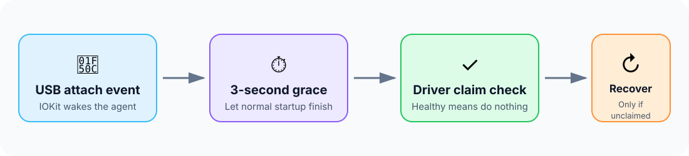

<p align="center">
  
</p>

<p align="center">
  <a href="https://github.com/akiyamasho/wacom-cintiq-reconnect-fix/actions/workflows/ci.yml"></a>
  <a href="https://github.com/akiyamasho/wacom-cintiq-reconnect-fix/releases/latest"></a>
  
  
  <a href="LICENSE"></a>
</p>

# Wacom Cintiq Reconnect Fix

A tiny, event-driven macOS helper for the failure mode where a Wacom Cintiq's
display reconnects normally but Wacom Center says no tablet is connected.

The helper does **not poll**. It sleeps until IOKit reports a USB attach or
detach event. After an attach, it gives the official driver three seconds to
initialize, checks for a Wacom-created HID client, and restarts only the
relevant Wacom user services if the HID claim failed.

> [!NOTE]
> This is an independent community workaround, not an official Wacom product.
> Keep the current official Wacom driver installed.

## Install

Requires macOS 13 or newer and Apple's free Command Line Tools.

```sh
xcode-select --install # skip if already installed
git clone https://github.com/akiyamasho/wacom-cintiq-reconnect-fix.git
cd wacom-cintiq-reconnect-fix
./scripts/install.sh
```

No `sudo`, kernel extension, accessibility permission, or background network
access is required. The installer builds from source, replaces an older polling
version of this helper if present, and starts a user LaunchAgent.

The default target is `Cintiq Pro 16`. To change the product name or safeguards:

```sh
WACOM_PRODUCT_NAME="Cintiq Pro 24" \
WACOM_GRACE_SECONDS=3 \
WACOM_COOLDOWN_SECONDS=120 \
./scripts/install.sh
```

## How it works

<p align="center">
  
</p>

The recovery is deliberately narrow:

1. Match Wacom USB vendor ID `0x056a` and the configured product name.
2. Wait for ordinary Wacom initialization to finish.
3. Search that USB device's IOService subtree for an `IOHIDLibUserClient`
   created by `WacomTabletDrive`. A USB-level inspection handle alone is not a
   tablet claim.
4. If missing, run `launchctl kickstart -k` for:
   - `com.wacom.wacomtablet`
   - `com.wacom.DataStoreMgr`
   - `Wacom_IOManager`
5. Enforce a 120-second cooldown against restart loops.

While the tablet is connected and healthy, there is no repeated check. The
agent remains blocked on Apple's notification port and consumes no polling
wakeups.

## Status and logs

```sh
launchctl print "gui/$(id -u)/com.local.wacom-recovery"
tail -f "$HOME/Library/Logs/WacomRecovery.log"
```

A normal reconnect produces a log like:

```text
USB device attached; checking driver claim in 3s
driver claim is healthy; no action needed
```

If the Wacom claim is missing, the second line is replaced by a targeted
three-service restart.

## Uninstall

```sh
./scripts/uninstall.sh
```

Add `--purge` to remove the helper's log and legacy cooldown cache as well.

## Prebuilt binary

Each tagged [GitHub release](https://github.com/akiyamasho/wacom-cintiq-reconnect-fix/releases)
contains an ad-hoc-signed universal Apple silicon + Intel binary and a SHA-256
checksum. Building through the installer remains the simplest trust path
because the executable is compiled locally from this repository.

## Build

```sh
make release    # current architecture
make universal  # arm64 + x86_64
```

The project has no third-party runtime dependencies.

## Why this exists

This workaround was isolated from a real Cintiq Pro 16 reconnect failure. The
display path came back, but Wacom's long-running user driver logged a failed
device filter/claim. Restarting the entire Mac was unnecessary: restarting the
three Wacom user-session jobs restored pen input. This agent performs that same
recovery only when the specific unhealthy state is observed.

## Contributing

Bug reports with the macOS version, Wacom driver version, exact USB product
name, and sanitized log excerpt are welcome. Please read [`AGENTS.md`](AGENTS.md)
before automated or agent-assisted changes.

## License

[MIT](LICENSE) © 2026 Sho Akiyama
